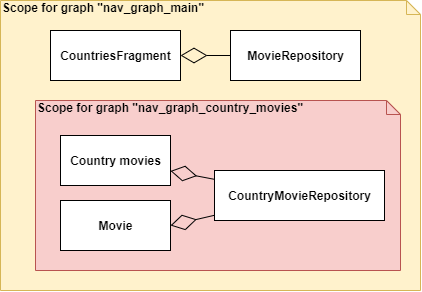

# Koin scope with navigation component

В этом примере я попробовал привязать скоупы из Koin к графам навигации из Jetpack Navigation Component

### Что из себя представляет приложение
Приложение со списком фильмов, которые отсортированые по странам

В приложении есть 3 экрана
* CountriesFragment - выбор страны фильмов
* CountryMoviesFragment - список фильмов для страны
* MovieFragment - описание фильма

Упрощенная диаграмма приложения:

  

### Скоупы
Мне хотелось привязать скоупы к графам навигации, чтобы делать для отдельных фич свои графы навигации, в которых будут свои скоупы.

Для хранения скоупа написан класс `NavGraphScopeHolder`. `NavGraphScopeHolder` является `ViewModel` (из Jetpack). Это нужно, чтобы получить экземпляр `NavGraphScopeHolder` привязанный к текущему графу навигации (с помощью метода `navGraphViewModels()`). `NavGraphScopeHolder` создает скоуп внутри конструктора и закрывает его, когда вызывается метод `onCleared()`.

Чтобы получать скоупы из фрагмента написан класс `BaseFragment` и метод `getScope(Int)`, внутри которого из экземпляра `NavGraphScopeHolder` достается Scope.

```kt
abstract class BaseFragment(@LayoutRes contentLayoutId: Int) : Fragment(contentLayoutId) {

    protected fun getScope(@IdRes navGraphId: Int): Scope {
        val holder by navGraphViewModels<NavGraphScopeHolder>(navGraphId) {
            object : ViewModelProvider.Factory {
                override fun <T : ViewModel?> create(modelClass: Class<T>): T =
                    NavGraphScopeHolder(navGraphId) as T
            }
        }

        return holder.scope
    }

}

class NavGraphScopeHolder(private val navGraphId: Int) : ViewModel() {

    val scope: Scope by lazy {
        KoinJavaComponent.getKoin().getOrCreateScope(
            navGraphId.navScopeId,
            navGraphId.navQualifier
        )
    }

    override fun onCleared() {
        scope.close()
    }

}

```

 ScopeID и Qualifier формируются с помошью идетификатора графа навигации. 

```kt
val Int.navQualifier: Qualifier
    get() = named("FlowQualifier (NavGraphId@$this)")

fun navQualifier(navGraphId: Int) =
    navGraphId.navQualifier

val Int.navScopeId: ScopeID
    get() = "ScopeId (NavGraphId@${this})"


```

### Пример описания зависимостей

```kt
startKoin {
            modules(module {
                scope(navQualifier(R.id.nav_graph_main)) {
                    scoped<IMovieRepository> {
                        MovieRepository()
                    }
                }
                scope(navQualifier(R.id.nav_graph_country_movies)) {
                    scoped<IMovieRepository> { parameters ->
                        CountryMovieRepository(parameters.component1())
                    }
                }
            })
        }
```
